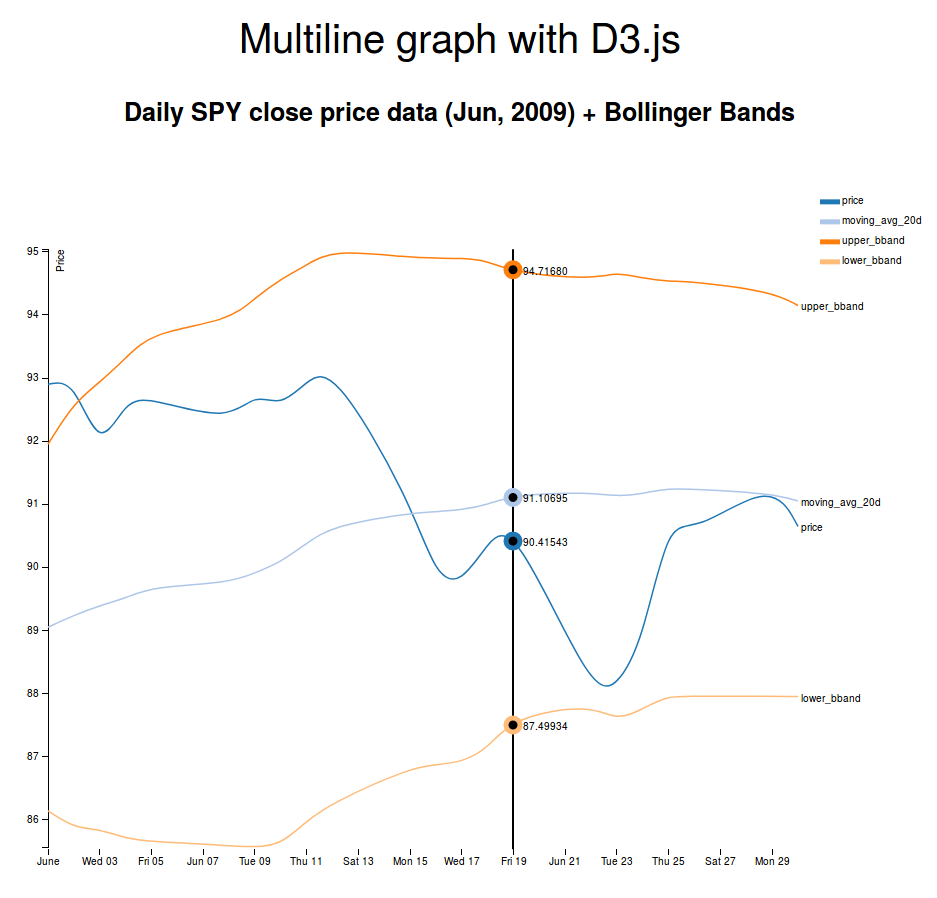

# d3js-multilinechart-stock-data
Multiline chart for stock data visualization using D3.js
This is an example of a multiline chart created with D3.js using a small sample of daily SPY stock data from Jun-2009 among with the Bollinger Bands® for this sample of data based on a 20-period moving average and standard deviation. The original sample of data used for this D3.js use case example can be found in http://stockcharts.com/school/lib/exe/fetch.php?media=chart_school:technical_indicators_and_overlays:bollinger_bands:cs-bbands.xls.

Execute visualization:
- Clone repository locally.
- Open index.html file with your favourite browser.
